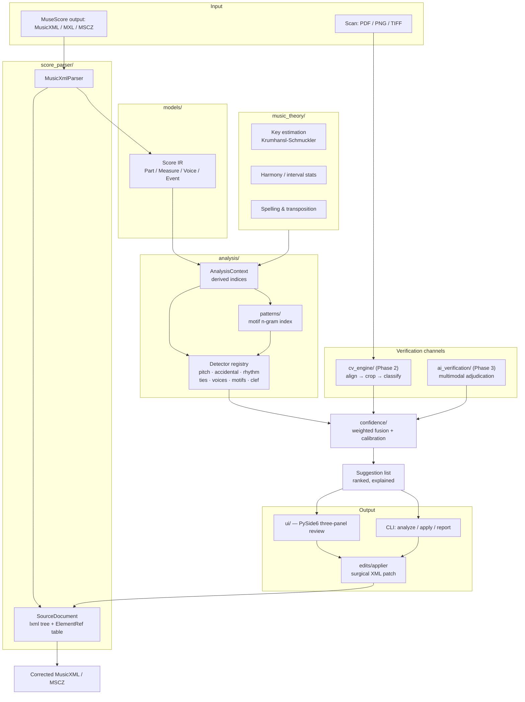

# AI Musical Proofreader — System Architecture

> Status: Phase 1 implemented. Phases 2–4 specified here and scheduled in [`ROADMAP.md`](ROADMAP.md).

## 1. What this system is (and is not)

It is a **verification layer that sits after OMR**. MuseScore Studio has already produced a
score; we treat that score as a *hypothesis* and the scan as *evidence*, and we look for places
where the two disagree or where the score is internally implausible.

It is **not** an OMR engine, and it must never behave like one. The distinction drives every
design decision below: we are allowed to be silent about most of the score, but when we speak we
have to be right. A proofreader that flags 400 things on a 30-page score has made the human's job
worse, not better.

### The precision contract

* Target operating point: **≥ 90% precision at the 70% confidence threshold**, measured on the
  regression corpus (`datasets/`), with recall reported but subordinate.
* Every suggestion carries an explanation a musician can verify in under five seconds.
* No suggestion is ever applied without an explicit accept. The applier is a separate module from
  the detectors and cannot be reached by the analysis pipeline.

## 2. Design decisions worth arguing about

These are the places where the obvious implementation is the wrong one. Written down because
"technical co-founder" means saying so before the code is written, not after.

### 2.1 Do not rebuild the MusicXML from an internal model

The natural design is `parse → model → analyse → serialize model`. It is wrong here. MuseScore's
MusicXML export carries page layout, system breaks, credits, beam positions, font choices,
`default-x`/`default-y` hints — hundreds of attributes we do not model and have no business
inventing. Round-tripping through an internal model silently destroys them, and the user's
"corrected" file comes back with a different page layout than the one they were proofreading.

**Instead:** the parser keeps the original `lxml` tree alive, and every element in the internal
representation holds an integer handle (`ElementRef`) into that tree. Corrections are applied as
**surgical patches** on the original document. A one-note pitch fix produces a one-line diff.
This also makes the applier trivially auditable, which matters when the product's core promise is
"we never break your score."

`SourceDocument` (in `score_parser/document.py`) owns this pairing. The IR is pure data and stays
JSON-serializable; the handles are integers, not element pointers.

### 2.2 music21 is a development dependency, not a runtime one

`music21` is excellent for musicology research and terrible for this job:

* It is lossy in exactly the way described above — it has its own object model and its export is a
  re-engraving, not a patch.
* Import cost is seconds per large score before analysis even starts; the 100-page/30s budget does
  not survive it.
* It has no provenance model, so we could not map a `note.Note` back to the XML element we need
  to patch.

We use it in `scripts/` to pull corpus material for the regression datasets, behind the
`[samples]` extra. The runtime parser is ~700 lines of `lxml` and knows precisely what it does
not know.

### 2.3 The hard part of CV verification is alignment, not symbol detection

The brief says "locate its coordinates in the original scanned image." OMR output generally does
**not** carry reliable image coordinates back to the source raster — MuseScore's MusicXML has
`default-x`/`default-y` in *engraving* space of the re-rendered score, not scan space. So the
localization step is a full sub-system, and it is the actual risk in Phase 2:

1. **Page → staff systems.** Horizontal projection profile + run-length staff-line detection,
   deskew via Hough/projection maximization, staff-line removal for symbol work.
2. **System → measures.** Barline candidates from vertical runs spanning the staff height; the
   measure *count* per system comes from the score, so this becomes a constrained segmentation
   (assign N detected barlines to M expected measures) rather than free detection.
3. **Measure → element.** Within a measure, x-position is proportional-ish to musical onset.
   Monotonic alignment (DTW) between the measure's onset sequence and detected notehead
   x-centroids gives a note-level anchor with a search radius, not a point.

Only after that does notehead/accidental/tie classification matter. Building step 4 first is the
classic way to burn a quarter and have nothing that works on a real page.

**Consequence for the data model:** every IR event can carry an optional `SourceRegion`
(page, bbox, confidence). Phase 1 leaves it `None`; nothing downstream may assume it is present.

### 2.4 The multimodal model is an adjudicator, not a scanner

Sending every measure to a vision model is the expensive way to get a mediocre result. A 100-page
orchestral score is ~50,000 notes; at even 200 tokens of image per crop that is a non-starter on
both latency and cost, and the model's per-symbol accuracy on isolated crops is not better than a
well-tuned classical detector.

**Gating rule:** a region reaches the AI verifier only when (a) musical analysis flags it *and*
(b) CV verification is either ambiguous or disagrees with the musical hypothesis. That is a few
dozen calls per score, batched, cached by crop hash. The model's job is to break a tie between two
explicitly stated interpretations — a task it is genuinely good at — not to read music from
scratch.

The `Verifier` protocol (`confidence/channels.py`) is uniform across CV and AI so the fusion layer
does not care which channels were available.

### 2.5 Stem direction is not evidence

MusicXML `<stem>` is a rendering hint that MuseScore recomputes on layout. Treating a "wrong" stem
direction as an error, as the brief suggests, would generate constant noise. We use it only as a
*corroborating* signal inside voice-assignment detection (weight 0.15), never as a primary trigger.
Same for `<beam>`.

### 2.6 Confidence must be calibrated, not asserted

A number printed as "91%" is a promise about frequency. Producing it by averaging three hand-tuned
heuristics is a lie with a decimal point. So:

* Each channel emits a raw score in `[0,1]` *and* declares whether it was applicable.
* Fusion renormalizes weights over available channels (`confidence/fusion.py`), applies an explicit
  **disagreement penalty** when channels conflict, and passes the result through a logistic
  calibration whose parameters live in config, not in code.
* The calibration parameters are fit against the synthetic corruption corpus, which is why that
  corpus is a Phase 1 deliverable and not an afterthought. `scripts/evaluate.py` prints the
  precision/recall curve that any change to a detector must not regress.

### 2.7 MSCZ is not our format

`.mscz` is a zip around MuseScore's private `.mscx` schema, which changes between major versions.
Reimplementing it would be a permanent maintenance tax for no user benefit. We read the container
to extract metadata and, when a MuseScore binary is present, shell out to it for conversion
(`score_parser/mscz.py`); MusicXML stays the interchange format in both directions. Phase 4's
plugin closes the loop from the MuseScore side, which is where that integration belongs.

## 3. Component map

## 4. Data flow, in order

1. **Load.** `SourceDocument.load(path)` handles `.musicxml`/`.xml` (plain), `.mxl` (zip
   container, reads `META-INF/container.xml`), `.mscz` (via MuseScore CLI if available).
   The lxml tree is retained.
2. **Parse.** `MusicXmlParser.parse()` walks parts and measures maintaining a *cursor* in
   divisions, honouring `<backup>`/`<forward>`, mid-measure `<attributes>`, `<chord/>` grouping,
   grace notes, `<time-modification>`, transposition. Emits the IR. Every `Note`, `Rest`,
   `Chord`, `Direction` and `Measure` carries its `ElementRef`.
3. **Index.** `AnalysisContext` computes, once, the things every detector would otherwise recompute:
   flattened voice streams, sounding-pitch (transposition-applied) timelines, per-window key
   estimates, vertical slices across parts, motif n-gram index, interval histograms.
4. **Detect.** Each `Detector` is a pure function `AnalysisContext → list[Suggestion]`. They cannot
   see each other and cannot mutate the context. Independent, so trivially parallel and trivially
   testable.
5. **Fuse.** Channel scores are combined per suggestion; duplicates (same target, same fix) are
   merged with evidence union — two independent detectors agreeing is a genuine confidence boost
   and is modelled explicitly rather than producing two list entries.
6. **Rank & present.** Sorted by confidence × severity, grouped by measure.
7. **Apply.** Accepted suggestions become `EditOperation`s; `EditApplier` patches the lxml tree.
   Every application is logged and reversible.

## 5. Module boundaries

| Module | Owns | May import | Must not |
|---|---|---|---|
| `models/` | The IR and the suggestion/edit vocabulary | pydantic, stdlib | know about XML, Qt, cv2 |
| `score_parser/` | MusicXML → IR, container formats, `ElementRef` table | `models`, lxml | analyse anything |
| `music_theory/` | Keys, intervals, spelling, harmony | `models`, numpy | know about detectors |
| `analysis/` | Detectors, context, motif index | `models`, `music_theory` | touch lxml or Qt |
| `confidence/` | Channel protocol, fusion, calibration | `models` | run detectors |
| `cv_engine/` | Scan → regions → visual evidence | `models`, cv2, numpy | import `analysis` |
| `ai_verification/` | Prompt construction, model calls, caching | `models`, `confidence` | import `analysis` |
| `edits/` | `EditOperation` semantics, XML patching | `models`, `score_parser`, lxml | make decisions |
| `ui/` | Qt shell, notation renderer, review workflow | everything | contain musical logic |
| `pipeline/` | Orchestration, budgets, reporting | everything except `ui` | contain musical logic |

The renderer is deliberately split: `ui/render/layout.py` is pure Python producing a
`RenderedScore` of primitive draw commands, and it is unit-tested without Qt installed;
`ui/render/qt_canvas.py` and `ui/render/svg.py` are thin backends. Notation layout bugs are found
in pytest, not by squinting at a screenshot.

## 6. Performance strategy

Budget for the stated target (100 pages, < 30s initial analysis) on a 4-core laptop:

| Stage | Budget | How |
|---|---|---|
| XML load + parse | 6s | `lxml.etree` C parser; single pass; no regex over XML |
| Context indexing | 6s | numpy for pitch histograms and key correlation; O(n) sweeps |
| Detectors | 12s | Per-part parallelism via `ProcessPoolExecutor`; each detector is O(n) or O(n·w) with a bounded window |
| Fusion + ranking | 1s | — |
| Reserve | 5s | — |

The rules that keep this true: no detector may be worse than O(n·log n) in events; the motif index
is built once and shared; nothing re-walks the XML after parse. `tests/test_performance.py`
asserts the budget against a generated 100-page score, marked `slow`.

CV and AI verification are explicitly **outside** this budget — they run as a second, incremental
pass that streams results into an already-usable suggestion list. The user sees musical findings
immediately and watches visual confirmations arrive.

## 7. Failure posture

* A malformed or partially-unreadable score must degrade, not abort: unparseable measures are
  recorded as `ParseIssue` and excluded from analysis, and the rest of the score is still checked.
* A detector that raises is caught, logged, and skipped — one bad rule cannot take down the run.
* Every applied edit is validated by re-parsing the patched tree before it is written to disk.
  If the patch produces an invalid score, the write is refused and the operation reported.
