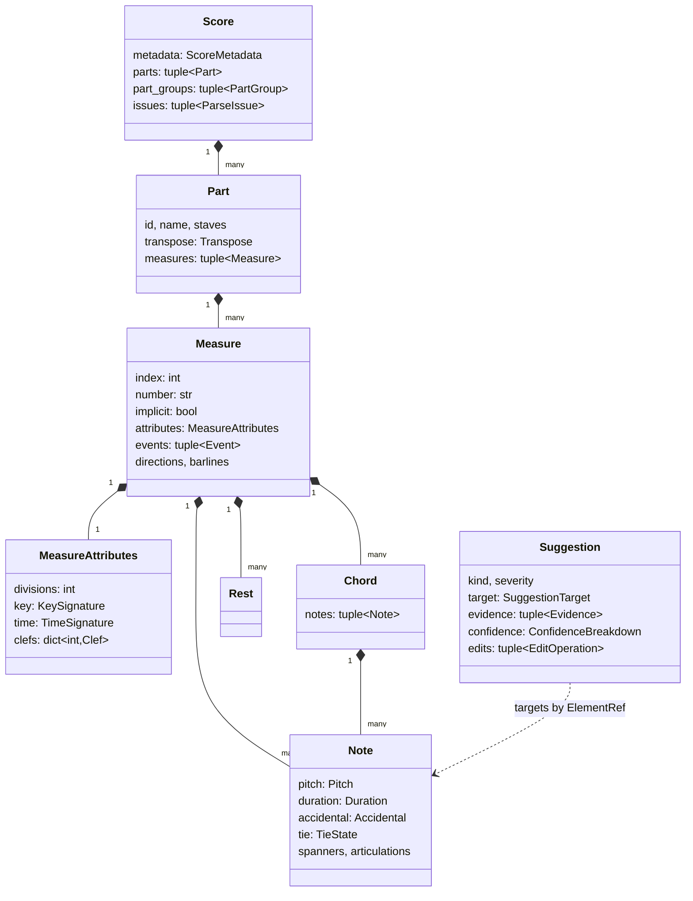

# Data Model

The internal representation lives in `src/ai_proofreader/models/` and is pure pydantic — no XML,
no Qt, no OpenCV. Everything else is written against these types.

## 1. The two coordinates of a pitch

This is the single most important decision in the model, and everything downstream depends on it.

```python
Pitch(step=Step.F, alter=1, octave=4)   # F#4
  .midi      == 66   # chromatic: what it sounds like
  .diatonic  == 31   # diatonic: which line or space it sits on
```

Two failure modes, two coordinates:

| OMR mistake | Chromatic change | Diatonic change | Repair |
|---|---|---|---|
| Notehead read one line off | ±1 or ±2 | **±1** | `pitch.step_shifted(±1)` |
| Accidental missed | **±1** | 0 | `pitch.with_alter(n)` |

A model that stored only MIDI numbers could not tell these apart, and would propose the wrong fix
about half the time. `Gb4` and `F#4` have the same `midi` and different `diatonic`; `F4` and `F#4`
have the same `diatonic` and different `midi`.

## 2. Time is rational

Every duration is a `fractions.Fraction` of a quarter note. A triplet eighth in 7/8 is `1/3`, not
`0.333…`. Float durations make measure-length checks produce phantom errors at the tenth decimal
place, which is a spectacular way to destroy precision. `models/rational.py` supplies the pydantic
adapter; durations serialize to JSON as `"3/2"`.

## 3. Structure



### Normalizations the parser applies

MusicXML's serialization conventions are optimized for round-tripping an engraver's state, not
for analysis. Three are normalized away:

| MusicXML says | The IR says | Why |
|---|---|---|
| A run of `<note>`s where all but the first carry `<chord/>` | One `Chord` event holding its `Note`s | "Which notes sound together" is a question every harmonic rule asks |
| Voices written sequentially with `<backup>` cursor jumps | Every event carries an explicit `onset` from the measure start | Nothing downstream should have to simulate a cursor |
| Attributes appearing once and applying until changed | Every `Measure` carries its full effective `MeasureAttributes` | A rule looking at bar 40 should not have to walk back to bar 1 to find the key |

Everything else is kept as it was found, including the distinction between the *sounding* tie
(`<tie>`) and the *printed* one (`<tied>`) — a file with one and not the other is itself a signal
(`TieState.is_inconsistent`).

## 4. `ElementRef`: how a note knows where it came from

```python
ElementRef = int   # an index into SourceDocument's element table
```

Every IR object that came from an XML element carries the handle of that element. The handle is a
plain integer rather than an element pointer for three reasons: the IR stays JSON-serializable,
it stays picklable across process-pool workers, and it cannot keep a detached XML subtree alive.

Handles are **stable across a re-parse** of an unmodified document (the parser registers elements
in document order), and **invalidated after a structural edit** — inserting or deleting an element
shifts every later handle. `EditApplier.has_structural_changes` reports this, and both the CLI and
the UI stop and ask for a re-analysis rather than applying a second edit against stale handles.

## 5. Transposition

`Part.transpose` holds the written-to-sounding interval. The rule throughout the system:

* **Analysis works in sounding pitch.** `AnalysisContext.note_refs[i].sounding` is precomputed.
  Harmonic analysis of a B-flat clarinet part against a concert-pitch chord is otherwise a whole
  tone wrong, every time.
* **Suggestions are phrased in written pitch.** That is what is on the page the user is checking.

## 6. Suggestions, evidence and edits

```python
Suggestion
├── target: SuggestionTarget      # part, measure, staff, voice, onset, element handles
├── evidence: tuple[Evidence]     # one item per reason, tagged with its channel
├── confidence: ConfidenceBreakdown   # per-channel scores + fused + calibrated
└── edits: tuple[EditOperation]   # exactly what accepting would do
```

`Evidence` carries a `supports_current_reading` flag. Evidence *against* a suggestion is kept
rather than discarded, because that is what lets a CV check that confirms the existing notation
cancel a musical suspicion instead of silently going missing.

A suggestion with no `edits` is **advisory** — "this bar does not add up and four different
changes would fix it". These are shown, ranked and explained, but the Accept button is disabled
(`Suggestion.is_actionable`). Guessing which of four notes is wrong would be worse than admitting
we cannot tell.

### Edit operations

The complete vocabulary through which a score may be changed, in `models/edit.py`:

`SetPitchOp` · `SetAccidentalOp` · `SetTieOp` · `SetSlurOp` · `SetDurationOp` · `SetVoiceOp` ·
`SetArticulationOp` · `SetDynamicOp` · `SetClefOp` · `SetKeyOp` · `InsertRestOp` ·
`RemoveElementOp`

Every operation names one element by handle and is individually reversible. `RemoveElementOp` is
the only one carrying a mandatory `reason`, because it is the only one that destroys information.

## 7. What is deliberately not modelled

Page layout, system breaks, beam angles, font choices, credits, `default-x`/`default-y` hints,
and everything else an engraver stores. Not because it does not matter — because *we do not
understand it well enough to rewrite it*, and the surgical-patch design means we never have to.
Those bytes travel from the input file to the corrected one untouched.
